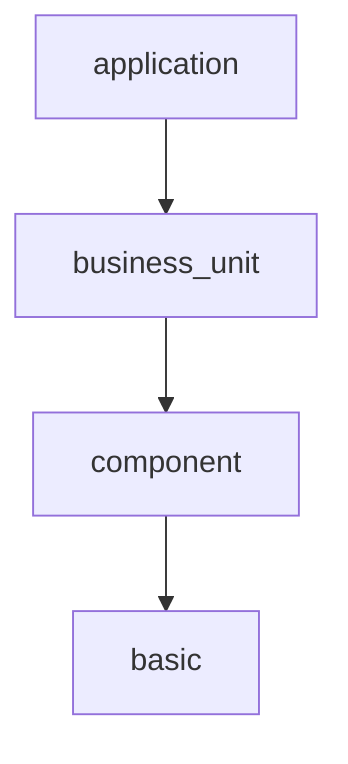

# 模型开发SDK建设说明      
@maintainer ：poppet

<!-- TOC -->

- [模型开发SDK建设说明](#%e6%a8%a1%e5%9e%8b%e5%bc%80%e5%8f%91sdk%e5%bb%ba%e8%ae%be%e8%af%b4%e6%98%8e)
  - [一. 背景](#%e4%b8%80-%e8%83%8c%e6%99%af)
  - [二. 设计思想](#%e4%ba%8c-%e8%ae%be%e8%ae%a1%e6%80%9d%e6%83%b3)
  - [三. 设计蓝图](#%e4%b8%89-%e8%ae%be%e8%ae%a1%e8%93%9d%e5%9b%be)
    - [现有架构](#%e7%8e%b0%e6%9c%89%e6%9e%b6%e6%9e%84)
    - [未来架构](#%e6%9c%aa%e6%9d%a5%e6%9e%b6%e6%9e%84)
    - [代码结构](#%e4%bb%a3%e7%a0%81%e7%bb%93%e6%9e%84)
    - [架构设计](#%e6%9e%b6%e6%9e%84%e8%ae%be%e8%ae%a1)
        - [整体层次](#%e6%95%b4%e4%bd%93%e5%b1%82%e6%ac%a1)
        - [basic layer](#basic-layer)
        - [component layer](#component-layer)
        - [bussiness_unit layer](#bussinessunit-layer)
        - [application layer](#application-layer)
  - [组件库更新机制](#%e7%bb%84%e4%bb%b6%e5%ba%93%e6%9b%b4%e6%96%b0%e6%9c%ba%e5%88%b6)
  - [项目实施](#%e9%a1%b9%e7%9b%ae%e5%ae%9e%e6%96%bd)
  - [开发计划](#%e5%bc%80%e5%8f%91%e8%ae%a1%e5%88%92)
  - [FAQ](#faq)

<!-- /TOC -->

## 一. 背景
T2产品向SAAS平台化发展，模型也需要相应升级，变得参数化和服务化。一方面需要和调度模块配 合，提供模型的控制参数。另一方面需要和应用模块配合，提供api式的服务。
T2的用户群都是规模比较小的客户，模型的个性化程度会较T1而言降低很多。但是需要快速构建服务， 快速提供模型。所以需要对现有的模型做组件化改造，来加快模型的构建。

## 二. 设计思想
T1阶段，所有模型是流程化的，烟囱型的，如加载数据—处理数据—特征工程—训练预测—调整输出。 并没有考虑单个模型内的OOP特性和模型间的方法复用。比如预测模型和畅平滞模型都会对销量做补全 处理，都会用到销售速度和有销售门店数作为特征。可以将方法从业务中抽象出来，将纯粹的逻辑精简 成通用方法。随着通用方法的丰富，以后的开发更多的是配置代替重头开发。

## 三. 设计蓝图

### 现有架构

### 未来架构

### 代码结构

### 架构设计

##### 整体层次

##### basic layer
为了清晰地定义和描述供应链行业底层业务知识，特定义了该层。通过持续的行业洞察和理解，来实现对行业底层知识的积累和复用。该模块

##### component layer

##### bussiness_unit layer

##### application layer

## 组件库更新机制

## 项目实施
组件化模型会提供代码包和文档(设计文档及api文档)。 
项目或者产品拿到代码后，按照给出的application中的样例构建模型。如果遇到组件化模型提供
不了的方法，需要自己开发。开发方式为继承现有的类，然后添加新的方法。

## 开发计划

## FAQ
