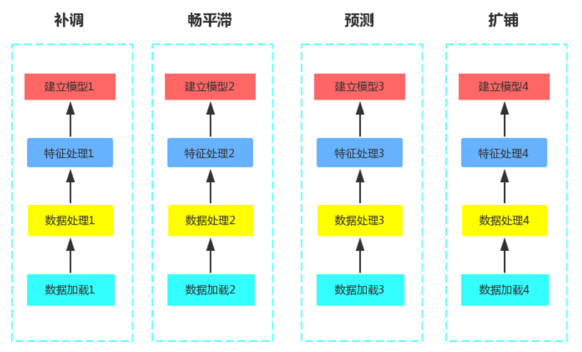
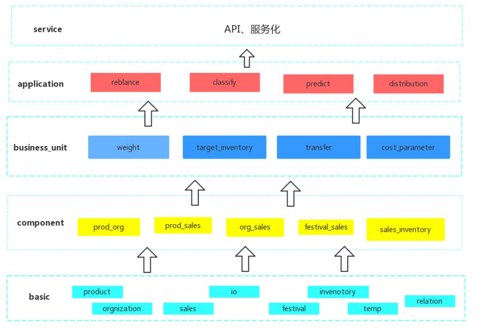
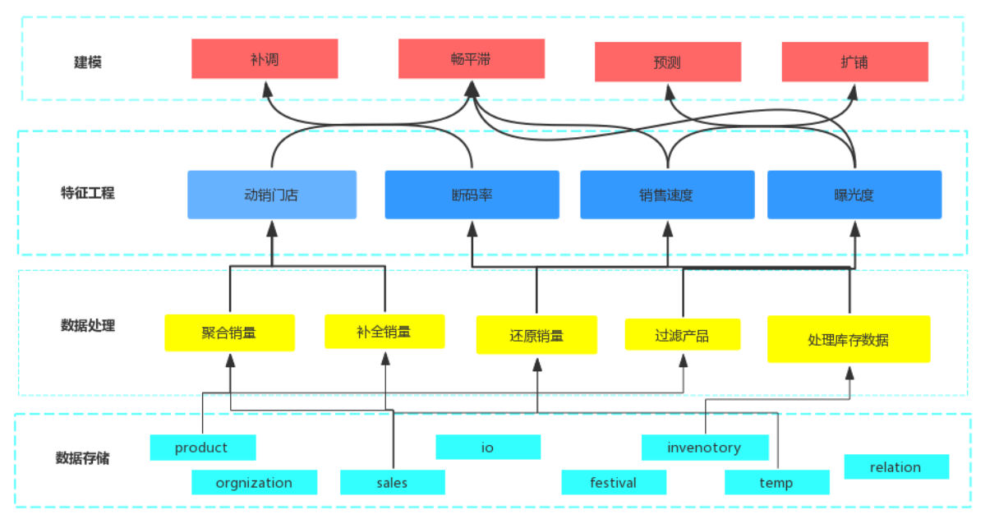

# 模型开发SDK建设说明

>
  @date: 2020-05-08

  @maintainer ：poppet

<!-- TOC -->

- [模型开发SDK建设说明](#%e6%a8%a1%e5%9e%8b%e5%bc%80%e5%8f%91sdk%e5%bb%ba%e8%ae%be%e8%af%b4%e6%98%8e)
  - [一. 背景](#%e4%b8%80-%e8%83%8c%e6%99%af)
  - [二. 设计思想](#%e4%ba%8c-%e8%ae%be%e8%ae%a1%e6%80%9d%e6%83%b3)
  - [三. 设计蓝图](#%e4%b8%89-%e8%ae%be%e8%ae%a1%e8%93%9d%e5%9b%be)
  - [四. 版本里程碑](#%e5%9b%9b-%e7%89%88%e6%9c%ac%e9%87%8c%e7%a8%8b%e7%a2%91)
  - [五. 项目实施](#%e4%ba%94-%e9%a1%b9%e7%9b%ae%e5%ae%9e%e6%96%bd)
  - [六. 开发计划](#%e5%85%ad-%e5%bc%80%e5%8f%91%e8%ae%a1%e5%88%92)
  - [七. FAQ](#%e4%b8%83-faq)

<!-- /TOC -->

## 一. 背景
T2产品向SAAS平台化发展，模型也需要相应升级，变得参数化和服务化。一方面需要和调度模块配 合，提供模型的控制参数。另一方面需要和应用模块配合，提供api式的服务。
T2的用户群都是规模比较小的客户，模型的个性化程度会较T1而言降低很多。但是需要快速构建服务， 快速提供模型。所以需要对现有的模型做组件化改造，来加快模型的构建。

## 二. 设计思想
T1阶段，所有模型是流程化的，烟囱型的，如加载数据—处理数据—特征工程—训练预测—调整输出。 并没有考虑单个模型内的OOP特性和模型间的方法复用。比如预测模型和畅平滞模型都会对销量做补全 处理，都会用到销售速度和有销售门店数作为特征。可以将方法从业务中抽象出来，将纯粹的逻辑精简 成通用方法。随着通用方法的丰富，以后的开发更多的是配置代替重头开发。

## 三. 设计蓝图

- 现有架构

- 未来架构

- 代码结构

- 架构设计

  - 整体层次 

    为了对业务应用实现最高层次的复用
    
  - basic layer
    >  
    为了清晰地定义和描述供应链行业底层业务知识，特定义了基础依赖层。通过持续的行业洞察理解，来实现对行业底层知识的积累和复用。
    该模块通过对库存，销量，商品，门店，活动，主码等不同行业要素主体进行明确划分与定义，打造行业概念基石。该层的具体组件定义请查阅 [basic layer document](./basic.md)

  - component layer
    >
    为了表示行业要素主体的关联性和实现跨主体的功能复用，定义了基础组件层。持续性丰富主体模块关联度能够为上层业务单元提供足够丰富的基础业务处理单元。
    该模块通过对库存、销量、商品和门店等主体任意两项甚至多项的组合来对组合业务单元的功能进行描述和定义。很明显，业务模块的丰富度直接影响着上层业务单元层和业务应用层的便利性和灵活性。该层的具体组件定义请查阅 [component layer document](./component.md)

  - bussiness_unit layer
    >
    对于现有业务场景中已经明确的业务处理逻辑，为了实现快速推广和一致性传播，通过对公司已经明确的业务模块进行提炼和修缮，构成了业务单元层。该层通过对主要业务模块的组织和编排，逐渐实现对已有业务场景的覆盖，从而实现从经典业务场景到新场景的有基础的快速拓展。该层的具体组件定义请查阅 [bussiness_unit layer document](./bussiness_unit.md)

  - application layer
    >
    对外显现的应用层是对一系列业务场景的清晰定义，通过对业务问题解决方案中的流程的描述，来针对性的解决供应链行业中的某些客户痛点。例如，通过定义补调应用来解决客户在商品跨门店流通，提高销售机会。
    该层的具体组件定义请查阅 [application layer document](./appication.md)

    
## 四. 版本里程碑
  
+  V1.0 补调组件集合
+  V2.0 快反组件集合
+  V3.0 补调和快反组件优化
+  V3.1 组件层次重新划分 
+  V3.2 组件参数丰富，组件配置参数提取

## 五. 项目实施
组件化解决了产品相同功能高效复用的问题,为了解决项目中的个性化需求，整个组件采用模块化+继承

组件化模型会提供代码包和文档(设计文档及api文档)。 
项目或者产品拿到代码后，按照给出的application中的样例构建模型。如果遇到组件化模型提供
不了的方法，需要自己开发。开发方式为继承现有的类，然后添加新的方法。

## 六. 开发计划

## 七. FAQ
